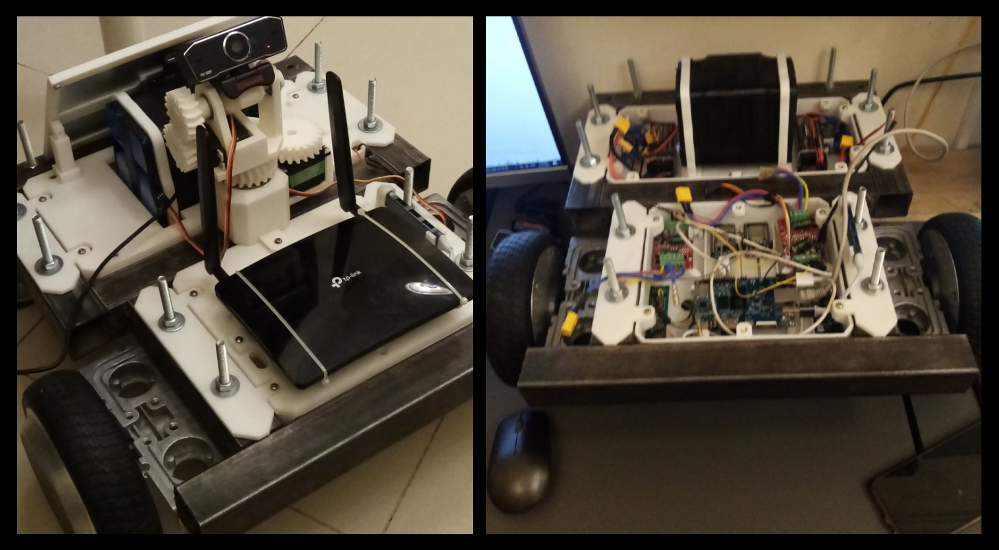
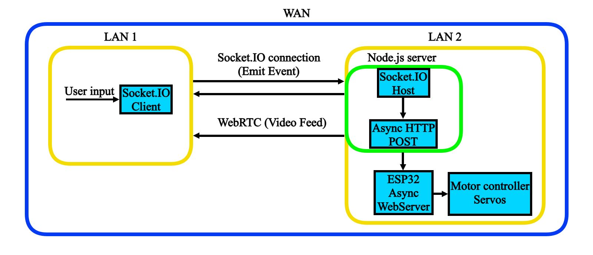
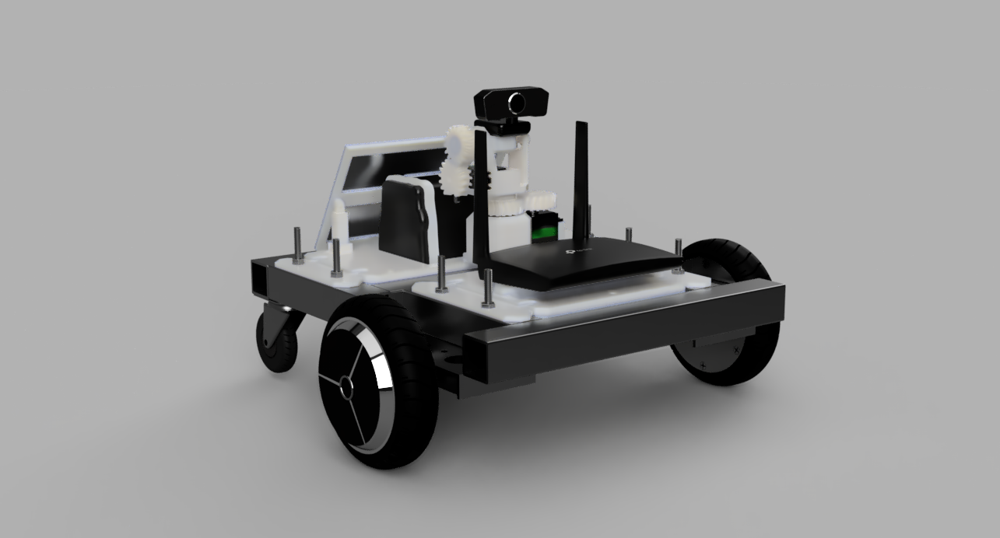
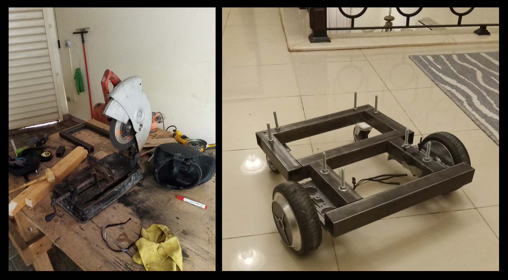
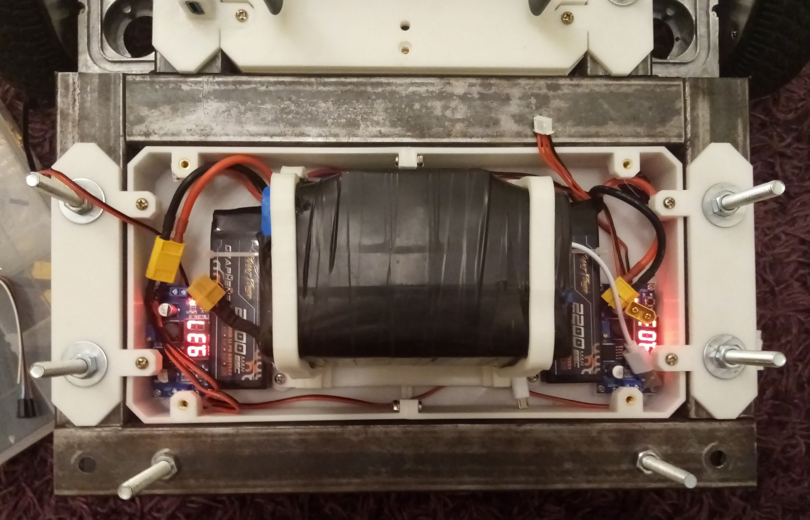
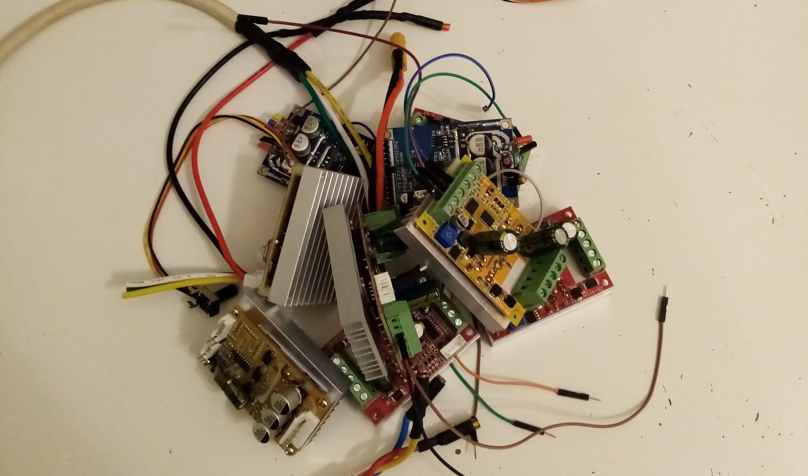
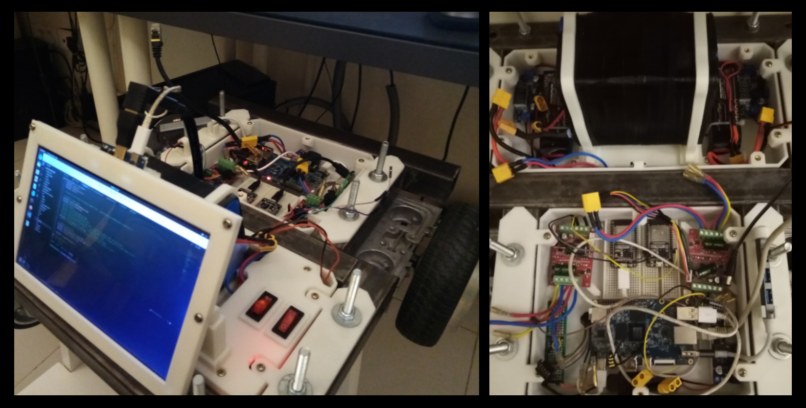
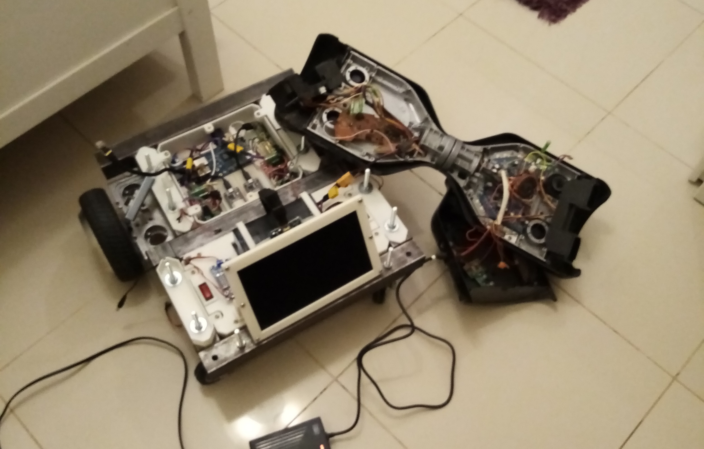

# NetRover32 (2022)

Long-range ESP32-based rover using a distributed network control system to achieve impressively low latency over very long distances.

# Overview

During my first year of upper secondary school in 2022, I became interested in RC planes and drones. While it was fun flying the aircraft and observing it from the ground or FPV goggles, I always wanted to push the limits and fly extremely far away. It was then I set as a goal to try to achieve control over extreme distances while having a live broadcast. After looking at current market solutions, I was highly dissatisfied and could only be promised a few extra km at the cost of a poor video feed and control. It became obvious to me that direct radio communication would be unideal, especially in more densely populated areas. I decided then and there to develop my own long-distance control system using the biggest network of them all, the Wide Area Network.

# The Distributed Network Control System (DNCS)

It quickly became obvious to me that lightweight communication protocols combined with integrated hardware would result in the best mix of high reliability while at the same time requiring low latency. A low power light weight system would also be very ideal in reaching this result. I also decided early on the most robust setup would be the client (user) pinging command inputs to the server (onboard the vehicle) and then later distributing the commands within the vehicles LAN.

Socket.IO became the obvious solution for this as it offers bi directional, low latency communication between server and client. Using WebSockets as a transport and event-based communication allows it to be lightweight as well and could be seamlessly integrated into a Node.js server. Having Socket.IO as the bridge over the WAN would mean that all commands distributed within the vehicle's LAN would have negligible latency in comparison, meaning almost all practical latency in this control system would be between client and server. I then needed a way to both push these commands forward within the LAN, have them received and then directly control the actuators. Enter the ESP32, a low-cost, energy-efficient microcontroller with network capabilities. The various user inputs could be received by the ESP32 within the LAN, then translated into PWM signals for control.

The only problem remaining was how to further push these commands from the Node.Js server to the ESP32. Coincedentally while working on this project, I stumbled upon someone with someone with a library the fitted my need. @ZanzyTHEbar had developed a library based on another community library [ESP32Async](https://github.com/ESP32Async/AsyncTCP). This would allow me the host an Async TCP server on the ESP32 within the LAN. Using a REST API I could send the inputs as parameters to the ESP32 server's URL where the ESP32 can grab the parameters and use them as real PWM values. Because of everything being contained in the same LAN the latency of all of this was negligible compared with the WAN connection. I decided to use Axios to call the REST API as it was lightewight and could be seemlessly integrated into my already existing Node.js server.

This ended up being a very sucessful control system, in multiple benchmark test I was able to consistently stay under 40 ms latency (from userinput to actuation) while having highly reliable control multiple kilometers from the clientside. As for the vehicles live video feed i decided to send it with webRTC which is a peer to peer communication system which allows video and voice to be transmitted. I decided to have the video feed transmitted from the server to the client from a single direction for lower latency. Attached below is a simple summary of the Distributed Network Control System.

# Vessle design & build

After figuring out the DNCS, the next step would be to implement it in some soft of vessle. While originally intended to be used in an aircraft, for a practical prototype i decided on a robust heavy rover-like vehicle. Around that time, I also had an old hoverboard laying around and decided then to repurpose its wheels for a rover. A steel frame with bolted wheels and space for future component mounts quickly became the leading design. I also decided to engineer a controllable 2-axis camera to be able to look around the environment. I also designed two internal component boxes, one for the power electronics and one for the overall control and function. The final CAD design:

Construction of the frame began with about 5 meters of 30x30mm square steel tubing being cut into pieces and welded. Since I didn't own a chop saw to make straight cuts, I brought in an old, used one to make the necessary cuts. With the square tube pieces, I welded everything together and started drilling holes for the bolts to be mounted. With the basic steel frame completed, the hoverboard wheels and castor wheels were bolted onto the final frame.

# Power system & electronics

To power the vehicle, I had acquired two high-power 36V Li-Ion batteries originally intended for hoverboard motors. I dedicated one of them to powering the two motors and another to the general electronics. In practice, this turned out not be enough, and I had to later add two supplementary 12V LiPo batteries to meet the system's capacity.

To control the hoverboard motors, I bought third-party high-power ESCs made for high-power BLDC motors. These motor controllers also supported PWM signals as input, which worked perfectly with my ESP32. These motor controllers, being cheap and having lackluster documentation, led to me frying a handful of them trying to configure them correctly. In future projects, I will be sure to use quality and documented products.

To host the Node.Js server and transmit the video feed, I brought in a Raspberry Pi 5 clone that connected to an ordinary router running data. For better user interaction, a USB hub and HDMI screen were mounted onto the frame, so that any bug fixes or small adjustments could be made on the rover and didn't require being plugged into external user devices. To power the Pi 5 clone, screen, servos, etc multiple step-down converters were needed, adding complexity to the total circuit. In later iterations of the power system, I installed clear and reliable power switches to avoid having to plug and unplug connectors every time it was in use or not.

# User integration

To control the rover, the server opens a server for the client to access via a browser. I forwarded the server using Cloudflare tunneling for higher security and ease of setup. The user can simply access the URL (esp32httpreq.com) where the browser immediately logs and emits the user's inputs to the vehicle. The browser server at the same time sends a live video feed to the client via WebRTC. With simple keyboard inputs, the user gains complete access to the rover and can now control the 2-axis camera, steer the rover, and observe the surroundings via the video feed. The soldered power switches make switching the rover on and off seamless and safe. Each power switch powers a certain set of electronics, making sure the user can test every stage before the rover completely powers on. One future fix is to make charging the rover more convenient, as I had no charger for the large Li-Ion batteries. Instead, I was forced to charge it using the previous hoverboard's main motherboard circuit. 

This is both unsafe and not very elegant. The attached screen and available external USB ports lead to greater ease of use and on-site bug fixing, allowing for more refined tuning. 

# Results

Overall, and by all practical metrics, I deemed this project a huge success. The DNCS proved successful in providing a reliable, lightweight, and, most importantly, low-latency method of delivering inputs to a vehicle. In many measured benchmarks, the one-way latency within the same city (with acceptable network conditions) was consistently under 40 ms. Testing from another country (6300 km distance), I found the latency to be consistently under 120 ms. These results are among the best I've seen from other similar-themed projects. The video attached below demonstrates me maneuvering flawlessly from my front gate to the local park 

# Future considerations

